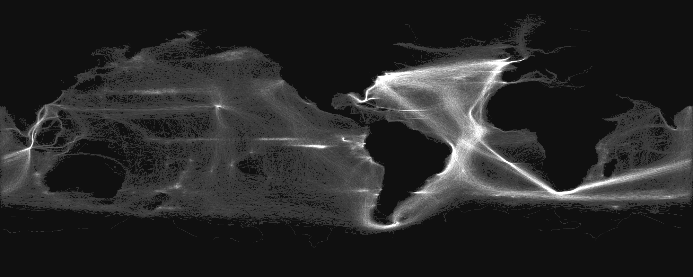

maury
=====

Code to process and filter ship course data from open ICOADS Maury data set, available [http://www1.ncdc.noaa.gov/pub/data/icoads2.5/]. You can learn about the format of the dataet here [http://icoads.noaa.gov/e-doc/imma/R2.5-imma_short.pdf]. This is quick and dirty because I wanted to generate some images for a talk, so use the js at your risk.
* icoads.js -- download desired data set from ICOADS 2.5 data set.
* find_voyages.js -- given the ICOADS data, process the data into individual voyages.
* parallel.js -- because processing the ICOADS data hits v8 memory limits, use parallels to run find_voyages.js in parallel.
* maury.js -- given voyages.txt (which you make with find_voyages.txt), produce .pngs of voyages. Usage like:
  node --max-old-space-size=1700 maury.js startyear endyear step voyages.txt outputname
  Produces images like:
  
* wind.js -- plot images of recoreded wind speed and direction
* speed.js -- test to see what images look like if they plot ship speed, not that interesting
* drawing.js -- use the awesome gm interface for node.js to blur images as a test.

If you don't want to download the data on your own, preprocessed voyage data here via dropbox [https://www.dropbox.com/s/x76rgn7b6wlchra/voyages.txt.zip]. 
